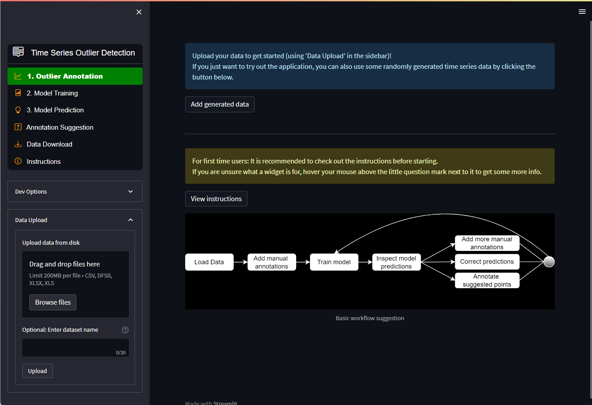

# tsod: Anomaly Detection for time series data.

 

Sensors often provide faulty or missing observations. These anomalies must be detected automatically and replaced with more feasible values before feeding the data to numerical simulation engines as boundary conditions or real time decision systems.

This package aims to provide examples and algorithms for detecting anomalies in time series data specifically tailored to DHI users and the water domain. It is simple to install and deploy operationally and is accessible to everyone (open-source).

## ✨ [Active learning web application](https://ts-outlier-detection.streamlit.app/) ✨

Please try the newly developed prototype web application for active learning (human in the loop). It is possible to test a version currently running in the Streamlit cloud: <https://ts-outlier-detection.streamlit.app/>

The web application is developed using [Streamlit](https://streamlit.io/). All requirements needed to run this application can be found [here](https://github.com/DHI/tsod/blob/main/.devcontainer/Dockerfile).

## Getting Started

* [Documentation](https://dhi.github.io/tsod/getting_started.html)
* [Notebook](https://github.com/DHI/tsod/blob/main/notebooks/Getting%20started.ipynb) 

## Installation

`tsod` is a pure Python library and runs on Windows, Linux and Mac.

From PyPI:

`pip install tsod`

Or development version:

`pip install https://github.com/DHI/tsod/archive/main.zip`

## Vision
* A simple and consistent API for anomaly detection of timeseries
* The computational speed will be good for typical timeseries data found in the water domain, to support realtime detection
* It will have a suite of different algorithms ranging from simple rule-based to more advanced based on e.g. neural networks

## Definitions
Note that we distinguish between [two types of anomaly detection](https://scikit-learn.org/stable/modules/outlier_detection.html)

- Outlier detection (unsupervised anomaly detection)
The training data may contain outliers, i.e. observations far from most other observations. Outlier detectors try to concentrate on the observations in the training data that similar and close together, and ignores observations further away.

- Novelty detection (semi-supervised anomaly detection)
The training data is considered "normal" and is not polluted by outliers. New test data observations can be categorized as an outlier and is in this context called a novelty.

## Contribute to `tsod`
[Open in Visual Studio Code](https://open.vscode.dev/DHI/tsod)
- Follow PEP8 code style. This is automatically checked during Pull Requests.

- If citing or re-using other code please make sure their license is also consistent with our policy.

