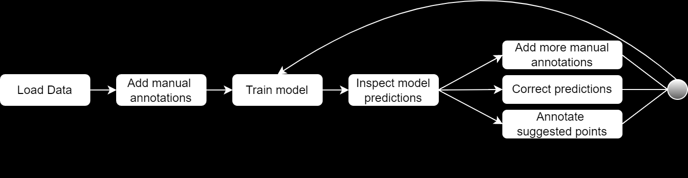

Welcome to the Time Series Outlier Detection web app!  
This project is a human-in-the-loop system for detecting outliers in time series, allowing for the cleaning of noisy datasets, which is often a requirement before the dataset can be used further (e.g. for training ML-models).

### General notes

- This app is currently a simple web app without user identification or saving of intermediate results. That means that if you refresh the page, you will start from scratch again. However, the app does allow for the download and upload of annotations, models and datasets so you may use them again at a later time.
- It is possible to upload multiple datasets containing multiple series (columns) each. You can add annotations and train models on every individual series. Is is currently not possible to train a single model using features from multiple series (multivariate outlier prediction). However, this is one of the possible future improvements.
### Recommended workflow

[invisible]: <> (Image streamlit hack)

[invisible]: <> (Image streamlit hack)

There are several ways of training your outlier detection models. Which one of those works best depends very much on your use case, however here are a few general guidelines. For more details on each step, please find the designated page instructions in the other tabs.

1. Upload your data (under *Data Upload* in the sidebar in the *Outlier Annotation*-page). There are a number of formats supported, see the instructions on Outlier Annotation.
2. Add some annotations for one of your series. If you have previously annotated and saved that series, remember to upload your annotations file from disk (under *Save / load previous* in the sidebar in the *Outlier Annotation*-page). No need to add too many annotations in the first iteration, better to train a model quickly to gain insights into what the model has learned.
3. Head to the page *Model Training*, choose a modelling method (currently only Random Forest Classifier is implemented) and choose some parameters (most of the modelling choices are abstracted away on purpose). Click on *Train Outlier Model* on the bottom of the sidebar to train an initial model.
4. After a short amount of time you will see a brief training summary including train set metrics, (if defined: test set metrics) and feature importances. The next step is to head over to the *Model Prediction*-page to judge the quality of the model. 
5. By default, model predictions for the entire training series are generated when training a model. On the prediction page, you can use any model to generate predictions on any of your datasets/series. Once you have some predictions, you will see them visualized in the main window. As there can be many predicted outliers (especially for earlier models), the predictions are summarized in the outlier distribution bar plot. Each bar represents a time window containing an equal number of datapoints and the height of the bar shows you how many outliers each model predicts in that window. Click on a bar of interest.
6. You can now see the predicted outliers in a new plot underneath. Try to identify patterns of faulty prediction and generate some new annotations by correcting them directly in the graph. You can also add individual annotations, just like in step 2).
7. Alternatively, you can also generate further annotations by heading the the *Annotation Suggestion*-page. There you are prompted to give simple yes or no answer for selected points (based on model uncertainty).
8. After having added some further annotations, you can train another model iteration. For this, either head back to the *Model Training*-page. If you don't want to change any model parameters, you can also click on 'Retain most recent model with new data' (available on both the *Model Prediction* and the *Annotation suggestion*-page). This will train a new model using the same parameters as before, generate new predictions and bring you to the prediction page for comparison.
9. Repeat the circle of adding annotations, retraining and evaluating the results until you are satisfied.
10. To remove outliers from any of your datasets/series, head to the *Data Download*-page. There you can create new datasets by removing predicted outliers, as well as download any dataset you have uploaded/created.